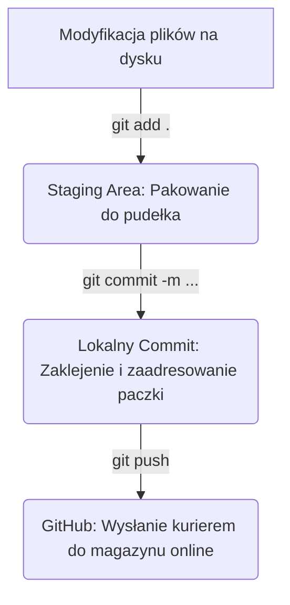

# 🛡️ Procedura Bezpiecznych Aktualizacji Aplikacji (AdRice Invoicing Hub)

Ten dokument opisuje procedurę krok po kroku, jak wdrażać aktualizacje kodu, modyfikacje oraz nowe wersje plików aplikacji (np. `index.html`, `adrice_scraper.js`), aby wykluczyć ryzyko utraty danych fakturowania oraz zapewnić ciągłość działania systemu.

---

## 🛑 KROK 1: Zabezpieczenie Danych (Eksport Bazy)
Przed jakąkolwiek zmianą kodu źródłowego musisz upewnić się, że aktualny stan rozliczeń (Twoja baza danych) jest bezpieczny.

1. Otwórz aktualnie używaną i działającą aplikację (`index.html`).
2. W panelu aplikacji znajdź i kliknij przycisk **"Eksportuj Bazę"** (lub równoważny przycisk pobierania stanu jako plik `.json`).
3. Zapisz pobrany plik bazy danych w bezpiecznym miejscu (np. w katalogu `ArchiveBackups` lub `Backup` z aktualną datą w nazwie, np. `adrice_backup_YYYYMMDD.json`).

> [!IMPORTANT]
> **Nigdy** nie przystępuj do edycji plików ani wgrywania nowego kodu bez uprzedniego wyeksportowania bazy danych z działającej przeglądarki!

---

## 🌿 KROK 2: Wykorzystanie Systemu Git (Kontrola Wersji)
Twój projekt jest objęty systemem kontroli wersji Git. To najpotężniejsze narzędzie chroniące Cię przed awariami.

1. Przed wprowadzeniem zmian upewnij się, że aktualny stabilny kod jest zatwierdzony w Git:
   * Otwórz terminal (np. PowerShell) w folderze `Invoicing` i wpisz:
     ```powershell
     git status
     ```
   * Jeśli masz zmodyfikowane pliki, które działają poprawnie, zatwierdź je:
     ```powershell
     git add .
     git commit -m "Zapis stabilnej wersji przed aktualizacja - YYYY-MM-DD"
     ```
2. Dzięki temu, jeśli nowa wersja nie będzie działać, będziesz mógł w 3 sekundy przywrócić ostatnią działającą wersję za pomocą komendy:
   ```powershell
   git restore .
   ```
   *(lub `git checkout .` w starszych wersjach)*.

---

## 📦 Jak działa Git i GitHub (Krok po kroku)

Jeśli chcesz zapisać swoje zmiany i wysłać je do internetowego repozytorium na **GitHub**, proces ten przypomina pakowanie i wysyłanie paczki:



### 1. Przygotowanie paczki (Dodawanie plików - `git add`)
Najpierw musisz wskazać Gitowi, które pliki chcesz wysłać.
* Aby dodać **konkretny plik** (np. tylko naszą procedurę):
  ```powershell
  git add procedura_aktualizacji.md
  ```
* Aby dodać **wszystkie nowe, zmodyfikowane i usunięte pliki** na raz:
  ```powershell
  git add .
  ```
  *(Kropka na końcu oznacza „dodaj wszystko z obecnego folderu”).*

### 2. Zaklejenie i opisanie paczki (Zatwierdzanie zmian - `git commit`)
Teraz tworzysz tzw. **Commit**. To lokalny zapis stanu na Twoim komputerze. Każdy commit musi mieć krótki opis, żebyś wiedział, co się zmieniło.
* Uruchom komendę:
  ```powershell
  git commit -m "Tutaj wpisz krótki opis zmian, np. Dodanie instrukcji bezpiecznych aktualizacji"
  ```

### 3. Wysłanie paczki do internetu (Wysyłanie na GitHub - `git push`)
Twój commit jest teraz zapisany na Twoim dysku, ale nie ma go jeszcze na GitHubie. Aby przesłać go do sieci, użyj komendy:
* Uruchom komendę:
  ```powershell
  git push
  ```
  *(Czasem przy pierwszym wypychaniu systemu Git poprosi o `git push origin master` lub `git push origin main`, ale zazwyczaj wystarczy samo `git push`).*

---


## 🧪 KROK 3: Testowanie Nowej Wersji "Obok" Produkcji
**Złota zasada:** Nigdy nie nadpisuj pliku `index.html` bezpośrednio, dopóki nie przetestujesz nowej wersji.

1. Zapisz nowy plik ze zmianami pod tymczasową nazwą, np. `index_TEST.html` (w tym samym folderze).
2. Otwórz `index_TEST.html` w przeglądarce.
3. Wgraj do wersji testowej wcześniej wyeksportowany plik bazy danych `.json` (Krok 1).
4. Wykonaj testowe fakturowanie:
   * Wgraj przykładowe pliki z Amsped/AdRice.
   * Sprawdź, czy aplikacja poprawnie przetwarza dane i nie zgłasza błędów w konsoli przeglądarki (klawisz `F12` -> zakładka *Console*).
   * Porównaj wyniki z dotychczasową wersją.

---

## 🚀 KROK 4: Wdrożenie Produkcyjne (Nadpisanie)
Dopiero gdy upewnisz się, że wersja testowa działa bez zarzutu:

1. Zamknij karty z aplikacją w przeglądarce.
2. Stwórz ręczną kopię bezpieczeństwa starego pliku `index.html` (np. zmień nazwę starego pliku na `index_OLD_[data].html`).
3. Zmień nazwę przetestowanego pliku `index_TEST.html` na docelową: `index.html`.
4. Otwórz nowy plik `index.html` w przeglądarce i zaimportuj plik bazy danych `.json`.
5. Zrób ostateczny commit w Git, aby zapisać ten krok milowy:
   ```powershell
   git add index.html
   git commit -m "Aktualizacja index.html do nowej wersji"
   ```

---

## 🛠️ Procedura Awaryjna (Co zrobić, gdy coś pójdzie nie tak?)

Jeśli po aktualizacji aplikacja nie działa, zawiesza się lub błędnie liczy dane:

### Scenariusz A: Chcę szybko przywrócić poprzedni kod (rollback w Git)
Otwórz terminal w folderze projektu i wpisz:
```powershell
git restore index.html
```
To przywróci plik `index.html` do stanu z ostatniego commita.

### Scenariusz B: Zniknęły dane lub wyczyścił się stan w przeglądarce
1. Otwórz działający plik `index.html`.
2. Kliknij przycisk **"Importuj Bazę"** (lub przeciągnij plik kopii zapasowej do aplikacji).
3. Wskaż ostatni plik kopii zapasowej `.json` utworzony w **KROKU 1**.
4. Dane zostaną natychmiast przywrócone.
